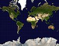
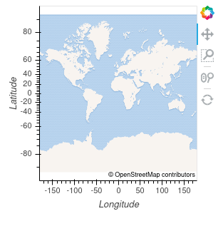
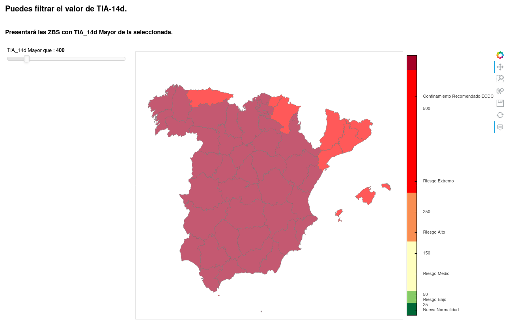
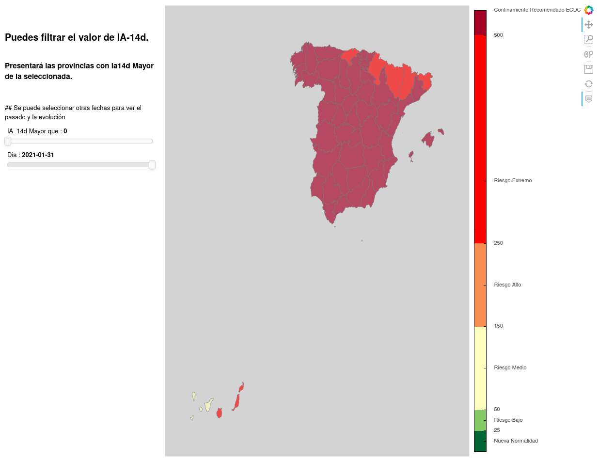

# py_Mapas

Mapas COVID con python

###  Provincias de España

#### Vamos a usar python y alguna de sus librerías para crear una representación gráfica de datos sobre un mapa.

##### Para ello necesitamos:

    1. Un mapa base.
    2. Shape de cada área del mapa.
    3. Datos a representar de cada área/shape.
    4. Asociar los datos de provincias a cada shape.
    5. Mapa con los datos.

#### En este caso, serán datos de situación del COVID-19 en España por provincias.
### Necesitamos datos:
- Los shapes de las provincias españolas forman el mapa de España.
- Un dato a representar en el mapa. He escogido la Tasa de Incidencia Acumulada en los últimos 14 días. Esta serie de datos se llamará **TIA_14d**.

### Necesitamos librerías que nos permitan acceder a los datos, procesarlos y presentarlos de manera interactiva:

- Podemos usar datos en local ó acceder a ellos a traves de su url pública. En este caso será con los datos de [@esCOVID19data](https://github.com/montera34/escovid19data) ==> https://github.com/montera34/escovid19data

- Vamos a usar distintas librerías para los gráficos: geoviews, holoviews, geoviews, en los mapas interactivos y matplotlib para crear ficheros png y luego un gif.

- Terminando con opciones interactivas.

  
### Empecemos preparando el entorno e importando las librerías que vamos a usar

## Crearemos un Mapa Base 

----
----
## Crearemos un Mapa con los shapes de la CAM
---
---
  
## 2. Colección de shapes de provincias de España.

### - Cargamos en un GeoDataFrame los shapes. Uso el fichero de shapes de carto por una buena relación entre la calidad de los shapes y su consumo de recursos.

He descartado los shapes oficiales, por tener Los ficheros los proporciona el Centro Nacional de Información Geográfica
- Proporciona los shapes de los límites administrativos de Provincias. [Datos de shapes](https://centrodedescargas.cnig.es/CentroDescargas)

https://vangdata.carto.com/tables/shapefiles_provincias_espana/public/map

- Podríamos acceder a estos ficheros directamente online ó descargarlo y usarlo como fichero local.
  
#### **PREVIAMENTE** he descargado el fichero con los shapes de las provincias a un subdirectorio llamado 'Shapes_Provincias'
### Cargando los shapes

----
----

## Cargaremos los datos de COVID y los presentaremos
  
## 3. Cargamos datos de COVID para cada provincia

- Usamos los datos de Escovi19data como fuente de datos COVID para todas las provincias desde el principio de la pandemia. Se actualiza a diario, Un gran trabajo, realizado por EsCovid19data. Está disponible en el repositorio  https://github.com/montera34/escovid19data  Puedes usarlo. Es muy laborioso conseguir datos fiables para este dataset. Contrastando datos de las Comunidades Autónomas y el Instituto de Salud Carlos III.

[Datos COVID-19 por provincia](https://raw.githubusercontent.com/montera34/escovid19data/master/data/output/covid19-provincias-spain_consolidated.csv)

#### Cargamos los datos directamente desde el repositorio para usar siempre los datos más actualizados.
#### El dataset tiene un registro para cada provincia, cada día.
#### - Tiene múltiples columnas ahora vamos a usar:
#####   - 'date': la fecha de cada registro
#####   - 'province': Nombre de la provincia
#####   - 'ine_code': Código del Instituto Nacional de Estadística para identificar la provincia.
#####   - 'ccaa': Comunidad Autónoma a la que pertenece esta provincia.
#####   - 'poblacion': población de esta provincia según el padrón de 2019
#####   - 'ia14': Incicencia Acumulada a 14 días

  
##### podríamos descargar el fichero csv y acceder al fichero descargado

----
----
## Además exportamos al final un fichero html, independiente e interactivo! ;)
[Mapas peninsula canarias semáforo COVID]("img/Mapa_peninsula_COVID_semaforo.html")

## Filtramos las provincias que superan el umbral

## Seguimos evolucionando
## - Empezamos a usar todos los datos desde marzo de 2020
## - Añadimos más interactividad y opciones de filtrado
## - Ahora se puede filtrar el umbral de TIA_14d
## - Y se puede seleccionar otra fecha distinta para ver la evolución
##

### Creamos también un fichero png para cada fecha
### 
 
 
### Los juntamos en distintos ficheros gif, modificando los fps.
 
 
### Terminamos con creando un fichero mp4 generado con ffmpeg
